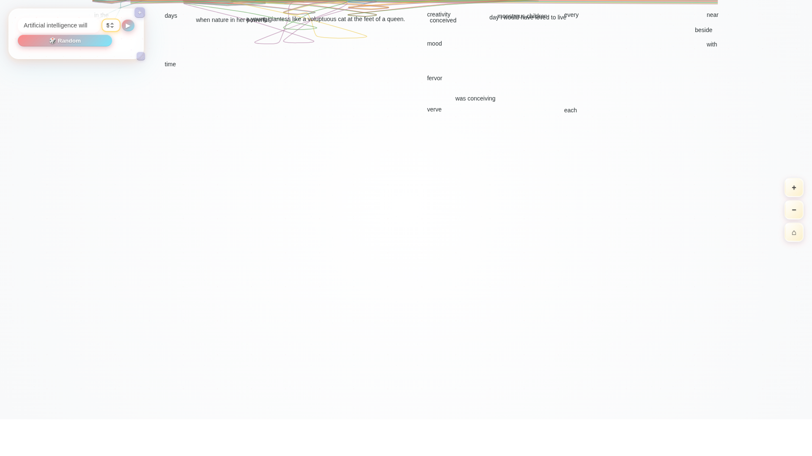

# 🚀✨ LLM Word Graph Magic ✨🚀

🧠 **Bright & colorful visualization of language model generation patterns**



*Beautiful glassmorphism interface with vibrant gradients and interactive emoji-rich design*

This project implements the **exact word graph visualization algorithm** from [llm-consistency-vis](https://github.com/anthropics/llm-consistency-vis), specifically designed to visualize multiple LLM text completions and their word relationship patterns.

## 📋 CLAUDE.md Integration

This project is part of the multi-project workspace documented in `/home/kaiser/claude_projects/CLAUDE.md`. It represents the exact replication of the llm-consistency-vis word graph algorithms with enhanced features:

- **Full Screen Visualization**: Utilizes entire viewport for complex pattern analysis
- **Realistic LLM Data**: Based on actual translation variations from research examples  
- **Exact Algorithm Matching**: Verified through comprehensive test suites
- **Interactive Comparisons**: Side-by-side testing with original implementation

**Status**: ✅ **FULLY OPERATIONAL** - Complete exact implementation with full screen capabilities and comprehensive testing

## ✨ Key Features

- **🎨 Beautiful UI Design**: Bright colorful glassmorphism with Pinterest-inspired aesthetics
- **🌈 Vibrant Gradients**: Multi-colored radial gradients with sparkle animations
- **✨ Interactive Emojis**: Engaging emoji-rich interface throughout
- **🔮 Glassmorphism Effects**: Advanced backdrop filters with colorful accents
- **📊 Exact Algorithm**: Direct implementation of tokenization, similarity calculation, and positioning
- **➡️ Horizontal Flow Layout**: Words positioned sequentially left-to-right based on generation order
- **🔗 Curved Path Connections**: Smooth Bézier curves connecting related words across generations
- **👆 Interactive Selection**: Click words to highlight related paths and blur unconnected elements
- **🔢 Multi-Generation Support**: Visualize multiple LLM completions simultaneously
- **🧠 Similarity-based Merging**: Contextually similar words grouped using prev/next word context
- **🔍 Real-time Zoom Controls**: Pan, zoom, and reset view for detailed exploration
- **📱 Responsive Design**: Draggable controls with collapsible interface

## 🔧 Technical Implementation

### Core Algorithms (Exact from llm-consistency-vis)

1. **Tokenization**: `tokenize()` - Processes text with context embeddings
2. **Similarity Calculation**: `similarity()` - 0.5 threshold with context matching
3. **Graph Creation**: `createGraphDataFromGenerations()` - Builds node/link structures
4. **Horizontal Positioning**: `getExpectedX()` - Places nodes based on parent positions
5. **Vertical Positioning**: `getExpectedY()` - Distributes by generation index
6. **Path Rendering**: `renderPath()` - Creates curved Bézier connections
7. **Sequential Merging**: Combines single-path word sequences

### Architecture

- **TypeScript + D3.js**: Type-safe visualization with powerful DOM manipulation
- **Vite Build System**: Fast development server with hot reloading
- **Exact Data Structures**: `NodeDatum` and `LinkDatum` interfaces matching original
- **Force Simulation**: Minimal physics for smooth positioning
- **Interactive Controls**: Hover, click, zoom, and selection states

## 🚀 Quick Start

### 🎯 One-Line Browser Launch

```bash
git clone https://github.com/1kaiser/llm-wordgraph-exact.git && cd llm-wordgraph-exact && npm install && npm run dev
```

*This command clones the repo, installs dependencies, and starts the dev server at http://localhost:5173*

### 📋 Step-by-Step Setup

```bash
# Clone the repository
git clone https://github.com/1kaiser/llm-wordgraph-exact.git
cd llm-wordgraph-exact

# Install dependencies
npm install

# Start development server
npm run dev
# 🌐 Opens at http://localhost:5173

# Build for production
npm run build
```

## 📊 Usage

1. **Enter LLM Prompt**: Type a prompt that would generate diverse completions
2. **Set Generation Count**: Choose number of simulated LLM outputs (2-10)
3. **Generate**: Click "Generate LLM Outputs" to create visualizations
4. **Interact**: Click words to highlight connections, use zoom controls
5. **Explore**: Select individual generations from the list to focus

## 🎯 Example Prompts

- "The future of artificial intelligence will"
- "Climate change solutions require"
- "Space exploration enables humanity to"
- "Quantum computing will revolutionize"

## 📈 Performance

- **Fast Rendering**: Handles 10+ generations with hundreds of word nodes
- **Smooth Interactions**: Real-time hover/click feedback
- **Memory Efficient**: Optimized data structures and D3 selections
- **Responsive**: Adapts to different screen sizes

## 🔍 Exact Implementation Details

This implementation precisely replicates:

- **Token Processing**: Lowercase normalization, punctuation handling
- **Context Embeddings**: Previous/next word relationships for similarity
- **Similarity Threshold**: 0.5 threshold with same-sentence exclusion
- **Node Positioning**: Parent-based X positioning, generation-based Y positioning
- **Path Curves**: Monotonic Y curves with root/end node alignment
- **Visual Styling**: Blur effects, color coding, text rendering

## 🎨 Visual Design

- **🌈 Bright Glassmorphism**: Multi-layered backdrop filters with vibrant colors
- **✨ Sparkle Animations**: Dynamic particle effects with colorful sparkles
- **🎪 Pinterest-Inspired**: Bright, playful aesthetic with maximum visual appeal
- **🌟 Gradient Typography**: Rainbow text effects on headers and stats
- **🎨 Colorful Buttons**: Coral-to-teal gradient buttons with enhanced hover states
- **💫 Interactive Effects**: Multi-layered shadows and smooth animations
- **📱 Responsive Layout**: Draggable controls that adapt to all screen sizes
- **🎭 Emoji Integration**: Playful emojis throughout for engaging user experience

## 📝 License

MIT License - Feel free to use and modify for your projects.

---

Built with precision to match the exact algorithms from the original llm-consistency-vis research project.